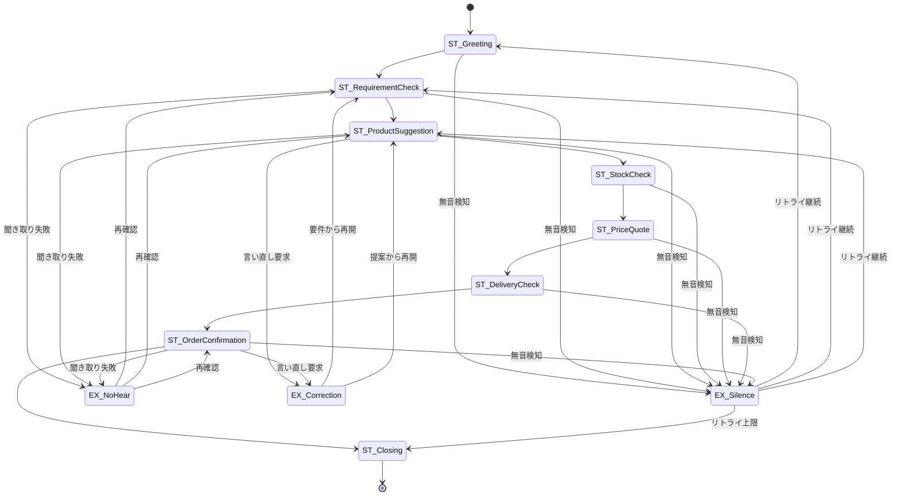

# Conversation Spec（音声販売AI：会話仕様 / 状態機械）
Version: 0.1 (MVP)
SSOT: docs/ConversationSpec.md

## 状態遷移図（Mermaid）



---

## 状態一覧（State）

### ST_Greeting
**目的**: 挨拶と通話開始

**入力例**:
- （発信側）「もしもし」
- （受信側）ユーザーの応答「はい」「もしもし」

**確認方法**: 暗黙（応答音声を検知したら次へ遷移）

**失敗時の戻り先**: EX_Silence（無音の場合）

**次状態**: ST_RequirementCheck

---

### ST_RequirementCheck
**目的**: ユーザーの要件・希望商品カテゴリを確認

**入力例**:
- 「どのような商品をお探しですか？」
- ユーザー回答例：「ノートパソコンが欲しい」「家電を見たい」

**確認方法**: 明示（「〇〇をお探しですね？」と復唱確認）

**失敗時の戻り先**:
- EX_NoHear（聞き取り失敗）
- EX_Silence（無音）

**次状態**: ST_ProductSuggestion

---

### ST_ProductSuggestion
**目的**: 具体的な商品を提案

**入力例**:
- 「こちらの商品はいかがでしょうか？（商品ID: ABC123）」
- ユーザー回答例：「それでお願いします」「他のも見たい」

**確認方法**: 明示（「この商品でよろしいですか？」）

**失敗時の戻り先**:
- EX_NoHear（聞き取り失敗）
- EX_Silence（無音）
- EX_Correction（「やっぱり別の商品で」→ ST_RequirementCheck）

**次状態**: ST_StockCheck

---

### ST_StockCheck
**目的**: 在庫確認（ツール呼び出し）

**入力例**:
- （システム内部）選択された productId を渡す
- ツール応答例：`{"available": true, "quantity": 15}`

**確認方法**: 暗黙（ツール結果を自動取得）

**失敗時の戻り先**:
- 在庫なし → ST_ProductSuggestion（代替品提案）
- ツールエラー → ST_Closing（エラー終了）

**次状態**: ST_PriceQuote

---

### ST_PriceQuote
**目的**: 価格提示（ツール呼び出し）

**入力例**:
- （システム内部）productId を渡す
- ツール応答例：`{"price": 89800, "currency": "JPY"}`

**確認方法**: 明示（「価格は89,800円です。よろしいですか？」）

**失敗時の戻り先**:
- EX_Silence（無音）
- ユーザー拒否 → ST_ProductSuggestion（再提案）

**次状態**: ST_DeliveryCheck

---

### ST_DeliveryCheck
**目的**: 配送日確認（ツール呼び出し）

**入力例**:
- （システム内部）productId + address を渡す
- ツール応答例：`{"deliveryDate": "2025-01-05", "estimatedDays": 3}`

**確認方法**: 明示（「配送は1月5日、3営業日後です。よろしいですか？」）

**失敗時の戻り先**:
- EX_Silence（無音）
- ユーザー拒否 → ST_Closing（注文キャンセル）

**次状態**: ST_OrderConfirmation

---

### ST_OrderConfirmation
**目的**: 最終確認と注文確定

**入力例**:
- 「では、商品ABC123を89,800円で、1月5日配送にて注文いたします。よろしいですか？」
- ユーザー回答例：「はい、お願いします」「やっぱりやめます」

**確認方法**: 明示（「はい」「いいえ」を明確に聞く）

**失敗時の戻り先**:
- EX_NoHear（聞き取り失敗 → 再度確認）
- EX_Correction（「やっぱり別の商品」→ ST_RequirementCheck）
- EX_Silence（無音）

**次状態**: ST_Closing

**DB保存タイミング**: この状態で「はい」を受信した時点で注文をDBに永続化

---

### ST_Closing
**目的**: 通話終了の挨拶

**入力例**:
- 「ありがとうございました。またのご利用をお待ちしております。」

**確認方法**: 暗黙（一方的に終了メッセージを流す）

**失敗時の戻り先**: なし（終了状態）

**次状態**: [*]（終了）

---

## 遷移（Transition / 分岐条件）

| 遷移元 | 条件 | 遷移先 | 備考 |
|---|---|---|---|
| ST_Greeting | 応答音声検知 | ST_RequirementCheck | - |
| ST_RequirementCheck | カテゴリ確定 | ST_ProductSuggestion | - |
| ST_ProductSuggestion | 商品選択確定 | ST_StockCheck | - |
| ST_StockCheck | 在庫あり | ST_PriceQuote | - |
| ST_StockCheck | 在庫なし | ST_ProductSuggestion | 代替品提案 |
| ST_PriceQuote | 価格承認 | ST_DeliveryCheck | - |
| ST_DeliveryCheck | 配送日承認 | ST_OrderConfirmation | - |
| ST_OrderConfirmation | 「はい」 | ST_Closing | DB保存実行 |
| ST_OrderConfirmation | 「いいえ」 | ST_Closing | 注文キャンセル |
| 任意の状態 | 無音検知 | EX_Silence | - |
| 任意の状態 | 聞き取り失敗 | EX_NoHear | - |

---

## 例外（聞き取れない/沈黙/言い直し）

### EX_Silence（沈黙検知）
**トリガー条件**: ユーザーからの音声入力が **5秒間**（MVP default）途絶えた場合

**リトライ動作**:
1. 「もしもし、お聞きになっていますか？」とプロンプト
2. リトライ回数: **3回**（MVP default）
3. 各リトライ間隔: 5秒

**終了条件**:
- 3回連続で無音（計15秒 + プロンプト時間）→ ST_Closing へ遷移し通話終了
- リトライ中に音声検知 → 元の状態に復帰

**OpenQuestion**: OQ-001参照（無音閾値5秒、リトライ3回は仮置き）

---

### EX_NoHear（聞き取り失敗）
**トリガー条件**: STT（音声認識）の信頼度が閾値未満（MVP: 0.6未満）

**リトライ動作**:
1. 「申し訳ございません、もう一度おっしゃっていただけますか？」
2. リトライ回数: 2回（MVP default）

**終了条件**:
- 2回失敗 → ST_Closing（通話終了）
- 聞き取り成功 → 元の状態に復帰

---

### EX_Correction（言い直し）
**トリガー条件**: ユーザーが「やっぱり」「違う」「他の」等のキーワードを発話

**動作**:
- ST_RequirementCheck に戻り、要件確認からやり直し
- 既に選択済みの商品IDはクリア

---

## ツール呼び出し（いつDBに保存するか）

### ツール契約（Tool Contracts）

#### 1. getStock（在庫確認）
**呼び出しタイミング**: ST_StockCheck 状態で即座に実行

**Input (JSON)**:
```json
{
  "productId": "ABC123"
}
```

**Output (JSON)**:
```json
{
  "available": true,
  "quantity": 15
}
```

**制約**:
- 在庫数・在庫有無は **必ずツール結果を使用**。推測・ハードコード禁止。
- タイムアウト: 3秒（MVP default）

---

#### 2. getPrice（価格取得）
**呼び出しタイミング**: ST_PriceQuote 状態で即座に実行

**Input (JSON)**:
```json
{
  "productId": "ABC123"
}
```

**Output (JSON)**:
```json
{
  "price": 89800,
  "currency": "JPY"
}
```

**制約**:
- 価格は **必ずツール結果を使用**。推測・ハードコード禁止。
- タイムアウト: 3秒（MVP default）

---

#### 3. getDeliveryDate（配送日取得）
**呼び出しタイミング**: ST_DeliveryCheck 状態で即座に実行

**Input (JSON)**:
```json
{
  "productId": "ABC123",
  "address": "東京都渋谷区..."
}
```

**Output (JSON)**:
```json
{
  "deliveryDate": "2025-01-05",
  "estimatedDays": 3
}
```

**制約**:
- 配送日は **必ずツール結果を使用**。推測・ハードコード禁止。
- タイムアウト: 5秒（MVP default）

---

#### 4. saveOrder（注文保存）
**呼び出しタイミング**: ST_OrderConfirmation で「はい」を受信した直後

**Input (JSON)**:
```json
{
  "productId": "ABC123",
  "price": 89800,
  "deliveryDate": "2025-01-05",
  "customerPhone": "+81-90-1234-5678",
  "timestamp": "2025-12-31T10:30:00Z"
}
```

**Output (JSON)**:
```json
{
  "orderId": "ORD-20251231-001",
  "status": "confirmed"
}
```

**制約**:
- DB保存は **必ずこのタイミング**。それ以前は揮発性メモリのみ。
- トランザクション保証必要（失敗時はロールバック → ST_Closing でエラー通知）

---

### ツール呼び出しのエラーハンドリング

| ツール | エラー条件 | 動作 |
|---|---|---|
| getStock | タイムアウト | ST_Closing（エラー終了） |
| getPrice | タイムアウト | ST_Closing（エラー終了） |
| getDeliveryDate | タイムアウト | ST_Closing（エラー終了） |
| saveOrder | 保存失敗 | リトライ1回 → 失敗時は ST_Closing + エラーログ記録 |

---

## まとめ

- 全状態に「入力例」「確認方法」「失敗時の戻り先」を定義済み
- EX_Silence は 5秒無音、3回リトライ、計15秒で終了（MVP default）
- 価格・在庫・配送日は **ツール結果に限定**（JSON I/O例を記載）
- Mermaid状態名と本文見出しを完全一致
- DB保存は ST_OrderConfirmation の「はい」受信時のみ
