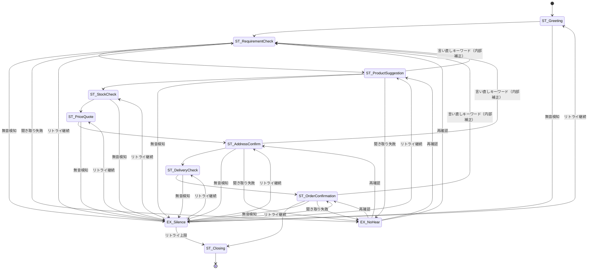

# Conversation Spec（音声販売AI：会話仕様 / 状態機械）
Version: 0.1 (MVP)
SSOT: docs/ConversationSpec.md

## 状態遷移図（Mermaid）



---

## 状態一覧（State）

### ST_Greeting
**目的**: 挨拶と通話開始

**システムプロンプト例**:
```
「お電話ありがとうございます。こちらは〇〇ショップの音声注文サービスです。
本日はどのような商品をお探しでしょうか？」
```

**ユーザー応答例**:
- 「はい」「もしもし」
- 「ノートパソコンが欲しいんですが」

**確認方法**: 暗黙（応答音声を検知したら次へ遷移）

**失敗時の戻り先**: EX_Silence（無音の場合）

**次状態**: ST_RequirementCheck

---

### ST_RequirementCheck
**目的**: ユーザーの要件・希望商品カテゴリを確認

**システムプロンプト例**:
```
「どのような商品をお探しでしょうか？」

（ユーザー回答後）
「ノートパソコンをお探しですね。確認させていただきます。」
```

**ユーザー応答例**:
- 「ノートパソコンが欲しい」
- 「家電を見たい」
- 「スマートフォン」

**確認方法**: 明示（「〇〇をお探しですね？」と復唱確認）

**失敗時の戻り先**:
- EX_NoHear（聞き取り失敗）
- EX_Silence（無音）

**次状態**: ST_ProductSuggestion

---

### ST_ProductSuggestion
**目的**: 具体的な商品を提案

**システムプロンプト例**:
```
「ノートパソコンでしたら、こちらの商品はいかがでしょうか？
〇〇社の△△△モデル、CPUはインテルCore i5、メモリ8GB、ストレージSSD256GBです。
こちらの商品でよろしいでしょうか？」
```

**ユーザー応答例**:
- 「それでお願いします」
- 「他のも見たい」
- 「もっと安いのはありますか？」

**確認方法**: 明示（「この商品でよろしいですか？」）

**失敗時の戻り先**:
- EX_NoHear（聞き取り失敗）
- EX_Silence（無音）
- 言い直しキーワード（内部補正）→ ST_RequirementCheck

**次状態**: ST_StockCheck

---

### ST_StockCheck
**目的**: 在庫確認（ツール呼び出し）

**入力例**:
- （システム内部）選択された productId を渡す
- ツール応答例：`{"available": true, "quantity": 15}`

**確認方法**: 暗黙（ツール結果を自動取得）

**失敗時の戻り先**:
- 在庫なし → ST_ProductSuggestion（同カテゴリの代替品を自動提案、候補が無ければ要件再確認）
- ツールエラー → ST_Closing（エラー終了）

**次状態**: ST_PriceQuote

---

### ST_PriceQuote
**目的**: 価格提示（ツール呼び出し）

**入力例**:
- （システム内部）productId を渡す
- ツール応答例：`{"price": 89800, "currency": "JPY"}`

**確認方法**: 明示（「価格は89,800円です。よろしいですか？」）

**失敗時の戻り先**:
- EX_Silence（無音）
- ユーザー拒否 → ST_ProductSuggestion（再提案）

**次状態**: ST_AddressConfirm

---

### ST_AddressConfirm
**目的**: 配送先情報の確認（住所と連絡先の整合）

**入力例**:
- 「配送先のご住所をお伺いしてもよろしいでしょうか？」
- ユーザー回答例：「東京都渋谷区...」「会社の住所は...」

**確認方法**: 明示（「配送先は〇〇でよろしいですか？」）

**失敗時の戻り先**:
- EX_NoHear（聞き取り失敗）
- EX_Silence（無音）
- 言い直しキーワード（内部補正）→ ST_RequirementCheck

**次状態**: ST_DeliveryCheck

---

### ST_DeliveryCheck
**目的**: 配送日確認（ツール呼び出し）

**入力例**:
- （システム内部）productId + address を渡す
- address は Contact.address を優先し、未取得時は ST_AddressConfirm で確認する
- ツール応答例：`{"deliveryDate": "2025-01-05", "estimatedDays": 3}`

**確認方法**: 明示（「配送は1月5日、3営業日後です。よろしいですか？」）

**失敗時の戻り先**:
- EX_Silence（無音）
- ユーザー拒否 → 代替配送日を1回提示（getDeliveryDate を再実行）→ 再拒否で ST_Closing（注文キャンセル）

**次状態**: ST_OrderConfirmation

---

### ST_OrderConfirmation
**目的**: 最終確認と注文確定

**システムプロンプト例**:
```
「それでは、ご注文内容を確認させていただきます。
商品は〇〇社△△△モデルのノートパソコン、価格は89,800円、
配送は1月5日の予定です。
こちらの内容で注文を確定してよろしいでしょうか？」

（ユーザーが「はい」と回答後）
「承知いたしました。ご注文を承りました。」
```

**ユーザー応答例**:
- 「はい、お願いします」
- 「はい」
- 「やっぱりやめます」
- 「もう一度考えます」

**確認方法**: 明示（「はい」「いいえ」を明確に聞く）

**失敗時の戻り先**:
- EX_NoHear（聞き取り失敗 → 再度確認）
- 言い直しキーワード（内部補正）→ ST_RequirementCheck
- EX_Silence（無音）

**次状態**: ST_Closing

**DB保存タイミング**: この状態で「はい」を受信した時点で注文をDBに永続化（ADR-001参照）

---

### ST_Closing
**目的**: 通話終了の挨拶

**システムプロンプト例**:
```
（注文成功時）
「ご注文ありがとうございました。
商品は1月5日にお届けの予定です。
またのご利用をお待ちしております。失礼いたします。」

（注文キャンセル時）
「承知いたしました。
またのご利用をお待ちしております。失礼いたします。」

（エラー終了時）
「申し訳ございません。システムエラーが発生いたしました。
お手数ですが、しばらく経ってから再度おかけ直しください。失礼いたします。」
```

**確認方法**: 暗黙（一方的に終了メッセージを流す）

**失敗時の戻り先**: なし（終了状態）

**次状態**: [*]（終了）

---

## 遷移（Transition / 分岐条件）

| 遷移元 | 条件 | 遷移先 | 備考 |
|---|---|---|---|
| ST_Greeting | 応答音声検知 | ST_RequirementCheck | - |
| ST_RequirementCheck | カテゴリ確定 | ST_ProductSuggestion | - |
| ST_ProductSuggestion | 商品選択確定 | ST_StockCheck | - |
| ST_StockCheck | 在庫あり | ST_PriceQuote | - |
| ST_StockCheck | 在庫なし | ST_ProductSuggestion | 代替品提案 |
| ST_PriceQuote | 価格承認 | ST_AddressConfirm | - |
| ST_PriceQuote | 価格拒否 | ST_ProductSuggestion | 再提案 |
| ST_AddressConfirm | 住所確定 | ST_DeliveryCheck | - |
| ST_AddressConfirm | 住所差し戻し | ST_AddressConfirm | 再確認 |
| ST_DeliveryCheck | 配送日承認 | ST_OrderConfirmation | - |
| ST_DeliveryCheck | 配送日拒否 | ST_DeliveryCheck | 代替日を1回提示、再拒否で ST_Closing |
| ST_OrderConfirmation | 「はい」 | ST_Closing | DB保存実行 |
| ST_OrderConfirmation | 「いいえ」 | ST_Closing | 注文キャンセル |
| 任意の状態 | 無音検知 | EX_Silence | - |
| ユーザー入力が必要な状態 | 聞き取り失敗 | EX_NoHear | ST_Greeting/RequirementCheck/ProductSuggestion/AddressConfirm/OrderConfirmation |
| 任意の状態 | 言い直しキーワード検知 | ST_RequirementCheck | 内部補正処理（専用状態は持たない） |

---

## 例外（聞き取れない/沈黙/言い直し）

### EX_Silence（沈黙検知）
**トリガー条件**: ユーザーからの音声入力が **7秒間**（MVP default）途絶えた場合

**リトライ動作**:
1. 「もしもし、お聞きになっていますか？」とプロンプト
2. リトライ回数: **2回**（MVP default）
3. 各リトライ間隔: 7秒

**終了条件**:
- 2回連続で無音（計14秒 + プロンプト時間）→ ST_Closing へ遷移し通話終了
- リトライ中に音声検知 → 元の状態に復帰（EX_Silence の復帰先と一致）

**OpenQuestion**: OQ-001参照（MVP default確定: 7秒、リトライ2回）

---

### EX_NoHear（聞き取り失敗）
**トリガー条件**: STT（音声認識）の信頼度が閾値未満（MVP: 0.55未満）

**リトライ動作**:
1. 「申し訳ございません、もう一度おっしゃっていただけますか？」
2. リトライ回数: **2回**（MVP default）

**終了条件**:
- 2回失敗 → ST_Closing（通話終了）
- 聞き取り成功 → 元の状態に復帰

**OpenQuestion**: OQ-004参照（信頼度閾値0.55は確定）、OQ-005参照（リトライ2回は確定）

---

### Correction（言い直し・内部例外処理）
**トリガー条件**: ユーザーが以下のキーワードを発話（MVP default: 5パターン）
1. 「やっぱり」
2. 「違う」
3. 「他の」
4. 「間違えた」
5. 「キャンセル」

**動作**:
- 専用状態（`EX_Correction`）には遷移しない
- 補正トリガ検知時に内部でリセットを実行し、`ST_RequirementCheck` に戻る
- リセット対象（実装 `resetAllForCorrection()` 相当）:
  - 商品・注文情報: `product`, `price`, `currency`, `deliveryDate`, `customerPhone`, `orderId`
  - 住所系: `address`, `addressConfirmed`, `awaitingAddressConfirm`
  - 要件系: `category`, `awaitingCategoryConfirm`, `suggestedProductIds`
  - 米要件系: `riceBrand`, `riceWeightKg`, `riceMilling`, `riceNote`
  - フラグ系: `awaitingBrandConfirm`, `awaitingWeightChoice`, `awaitingMillingChoice`, `brandConfirmed`, `awaitingDeliveryCancelConfirm`
  - リトライ系: `deliveryRetries`, `orderRetries`

**OpenQuestion**: OQ-007参照（キーワードリスト5つの妥当性） → ADR-004で解決済み

---

## 注文データ要件（saveOrder に必要な入力）

| フィールド | 取得元 | 補足 |
|---|---|---|
| productId | ST_ProductSuggestion | 商品確定済みのID |
| price | getPrice | ツール結果のみ使用 |
| deliveryDate | getDeliveryDate | ツール結果のみ使用 |
| address | ST_AddressConfirm | 明示確認済みの住所 |
| customerPhone | 通話メタデータ（取得不可時は口頭確認） | 電話番号は復唱確認 |
| timestamp | システム時刻 | 自動付与 |

---

## ツール呼び出し（いつDBに保存するか）

### ツール契約（Tool Contracts）

#### 1. getStock（在庫確認）
**呼び出しタイミング**: ST_StockCheck 状態で即座に実行

**Input (JSON)**:
```json
{
  "productId": "ABC123"
}
```

**Output (JSON)**:
```json
{
  "available": true,
  "quantity": 15
}
```

**制約**:
- 在庫数・在庫有無は **必ずツール結果を使用**。推測・ハードコード禁止。
- タイムアウト: 4秒（MVP default）

---

#### 2. getPrice（価格取得）
**呼び出しタイミング**: ST_PriceQuote 状態で即座に実行

**Input (JSON)**:
```json
{
  "productId": "ABC123"
}
```

**Output (JSON)**:
```json
{
  "price": 89800,
  "currency": "JPY"
}
```

**制約**:
- 価格は **必ずツール結果を使用**。推測・ハードコード禁止。
- タイムアウト: 4秒（MVP default）

---

#### 3. getDeliveryDate（配送日取得）
**呼び出しタイミング**: ST_DeliveryCheck 状態で即座に実行

**Input (JSON)**:
```json
{
  "productId": "ABC123",
  "address": "東京都渋谷区..."
}
```

**Output (JSON)**:
```json
{
  "deliveryDate": "2025-01-05",
  "estimatedDays": 3
}
```

**制約**:
- 配送日は **必ずツール結果を使用**。推測・ハードコード禁止。
- タイムアウト: 6秒（MVP default）

---

#### 4. saveOrder（注文保存）
**呼び出しタイミング**: ST_OrderConfirmation で「はい」を受信した直後

**Input (JSON)**:
```json
{
  "productId": "ABC123",
  "price": 89800,
  "deliveryDate": "2025-01-05",
  "customerPhone": "+81-90-1234-5678",
  "timestamp": "2025-12-31T10:30:00Z"
}
```

**Output (JSON)**:
```json
{
  "orderId": "ORD-20251231-001",
  "status": "confirmed"
}
```

**制約**:
- DB保存は **必ずこのタイミング**。それ以前は揮発性メモリのみ。
- トランザクション保証必要（失敗時はロールバック → リトライまたはST_Closing）

**リトライロジック**（ADR-003参照）:
1. DB保存失敗時、**1回**（MVP default）のみリトライ
2. リトライ間隔: 1秒（固定）
3. 2回連続失敗 → ST_Closingへ遷移、エラーログ記録
4. リトライ対象: すべてのDB保存失敗（エラーコードを問わない）

**OpenQuestion**: OQ-006参照（リトライ1回の妥当性） → ADR-003で解決済み

---

### ツール呼び出しのエラーハンドリング

| ツール | エラー条件 | 動作 |
|---|---|---|
| getStock | タイムアウト | ST_Closing（エラー終了） |
| getPrice | タイムアウト | ST_Closing（エラー終了） |
| getDeliveryDate | タイムアウト | ST_Closing（エラー終了） |
| saveOrder | 保存失敗 | リトライ **1回**（MVP default） → 2回連続失敗時は ST_Closing + エラーログ記録 |

---

## まとめ

- 全状態に「入力例」「確認方法」「失敗時の戻り先」を定義済み
- EX_Silence は 7秒無音、2回リトライ、計14秒で終了（MVP default）
- 価格・在庫・配送日は **ツール結果に限定**（JSON I/O例を記載）
- Mermaid状態名と本文見出しを完全一致
- DB保存は ST_OrderConfirmation の「はい」受信時のみ
